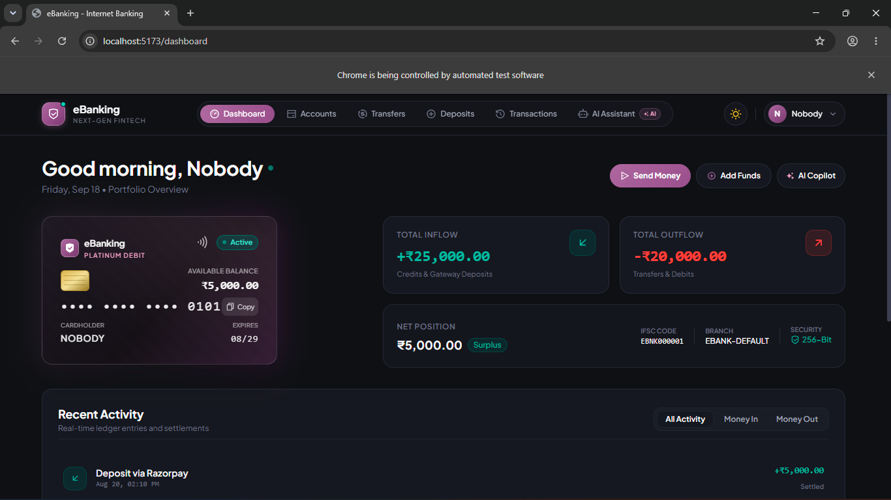
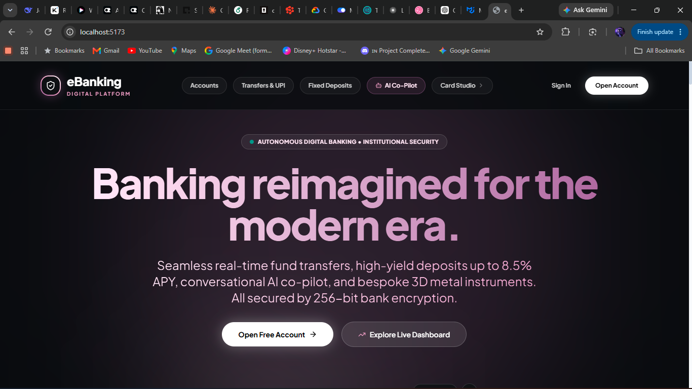
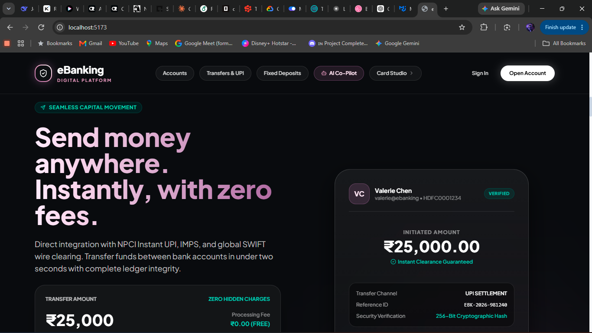
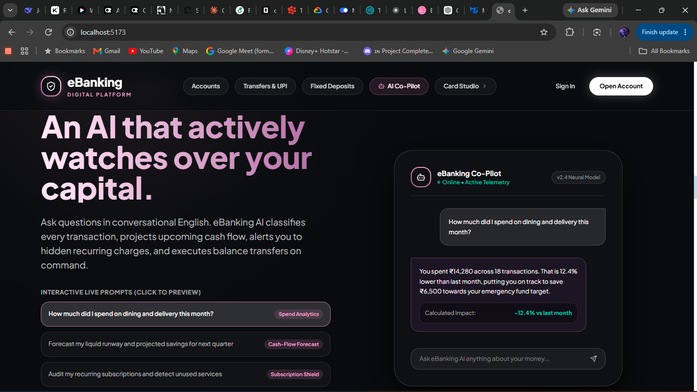

# eBanking Portfolio



A full-stack internet banking demo with real authentication, test-mode payments, AI assistant, and a 3D animated landing page.

## Features

- User registration with OTP verification
- JWT authentication with session revocation
- Savings account creation and management
- Deposits via Razorpay payment gateway
- Instant transfers with confirmation
- AI-powered financial assistant with privacy consent
- Admin dashboard for account approval
- 3D animated landing page (React Three Fiber)

## Screenshots

| Landing | Dashboard | Transfers | Profile |
|---------|-----------|-----------|---------|
|  |  |  |  |

## Quick Start

### Prerequisites
- Java 17+, Node.js 18+, MySQL 8+, Redis

### Backend
```bash
cd backend
cp .env.example .env
# Edit .env with your credentials
mvnw.cmd spring-boot:run    # Windows
./mvnw spring-boot:run       # Linux/macOS
```

### Frontend
```bash
cd frontend
npm install
npm run dev
```

Open http://localhost:5173 — the Vite proxy forwards `/api/*` to `localhost:8080`.

See [HOW_TO_RUN.md](HOW_TO_RUN.md) for full setup instructions.

## Architecture

| Layer | Technology |
|-------|------------|
| **Backend** | Spring Boot 3.5.7, Spring Security, JPA/Hibernate, Redis |
| **Frontend** | React 18, TypeScript, Vite, Tailwind CSS, Framer Motion, R3F |
| **Database** | MySQL |
| **Cache** | Redis |
| **Payments** | Razorpay (test mode) |

## Project Structure

```
backend/           Spring Boot REST API
  src/main/java/   Controllers, services, repositories, entities, DTOs
  src/main/resources/  Configuration (application.yml, .env)

frontend/          React SPA
  src/
    api/           Axios client + interceptors
    components/    Shared UI (Hero3D, Counter, VirtualCard)
    features/      Auth module (login, register, forgot password)
    hooks/         Custom hooks (useSmoothScroll, useLogout)
    pages/         Route-level components
    stores/        Zustand state (auth, ui)
    types/         TypeScript definitions

docs/              Documentation and screenshots
```

## API Documentation

Swagger UI: http://localhost:8080/swagger-ui/index.html

## License

MIT
