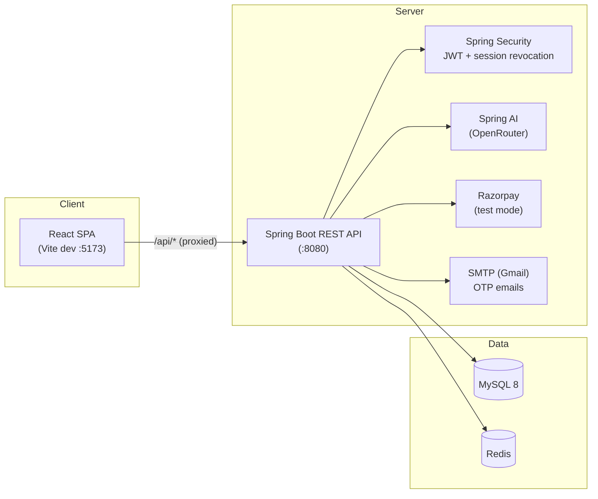

# eBanking


> A full-stack internet banking demo with real authentication, test-mode payments, an AI financial assistant, and a 3D animated landing page.

<p align="center">
  
  
  
  
  
  
  
</p>

---

## Table of Contents

- [Features](#features)
- [Screenshots](#screenshots)
- [Tech Stack](#tech-stack)
- [Architecture](#architecture)
- [Quick Start](#quick-start)
- [Environment Variables](#environment-variables)
- [Using the Application](#using-the-application)
- [Project Structure](#project-structure)
- [API Documentation](#api-documentation)
- [Security Notes](#security-notes)
- [Troubleshooting](#troubleshooting)
- [Production Build](#production-build)
- [Roadmap](#roadmap)
- [Contributing](#contributing)
- [License](#license)

---

## Features

| Area | Highlights |
|------|------------|
| **Authentication** | User registration with **6-digit OTP email verification**, JWT login with **session revocation**, account lockout after 5 failed attempts (15 min) |
| **Banking** | Savings account creation & management, deposits via **Razorpay payment gateway** (test mode), instant peer-to-peer transfers by mobile or account number |
| **AI Assistant** | AI-powered financial assistant (Spring AI → OpenRouter) with an explicit **privacy consent toggle** in Profile settings |
| **Admin** | Admin dashboard for reviewing and approving new accounts — no self-registration as admin |
| **Frontend** | 3D animated landing page (React Three Fiber), smooth scrolling (Lenis), animated UI (Framer Motion), charts (Recharts), toast notifications (Sonner) |

---

## Screenshots

| Landing | Dashboard | Transfers | Profile |
|---------|-----------|-----------|---------|
|  |  |  |  |

---

## Tech Stack

| Layer | Technology |
|-------|------------|
| **Backend** | Spring Boot 3.5.7 (Java 17), Spring Security, Spring Data JPA / Hibernate, Spring Mail, Spring AI (OpenRouter), Springdoc OpenAPI |
| **Frontend** | React 18, TypeScript, Vite, Tailwind CSS, Framer Motion, React Three Fiber + drei, Zustand, TanStack Query, React Hook Form + Zod |
| **Database** | MySQL 8 (`ddl-auto: update` — schema auto-created) |
| **Cache** | Redis (sessions / OTP / rate limiting) |
| **Payments** | Razorpay Java SDK (test mode) |
| **Tooling** | Maven Wrapper, Lombok, MapStruct, ESLint, PostCSS |

---

## Architecture



- **Ports** — Backend: `8080` · Frontend: `5173`
- **API base path** — `/api/v1`
- **Vite dev proxy** forwards `/api/*` → `localhost:8080`, so no CORS setup is needed in development.

---

## Quick Start

### Prerequisites

<p>
  
  
  
  
  
</p>

### 1. Database setup

```sql
CREATE DATABASE IF NOT EXISTS eBanking;
```

> Tables are created automatically on first boot (`ddl-auto: update`).

### 2. Backend

```bash
cd backend
cp .env.example .env
# Edit .env with your credentials (see table below)
./mvnw spring-boot:run        # Linux/macOS
mvnw.cmd spring-boot:run      # Windows
```

Wait for `Started EbankingApplication` then verify: http://localhost:8080/ redirects to Swagger UI.

### 3. Frontend

```bash
cd frontend
npm install
npm run dev
```

Open **http://localhost:5173**

> Need the full walkthrough? See [HOW_TO_RUN.md](HOW_TO_RUN.md).

---

## Environment Variables

Copy `backend/.env.example` → `backend/.env` and fill in:

| Variable | Purpose |
|----------|---------|
| `DB_*` | MySQL connection (host, port, `eBanking` database, user, password) |
| `REDIS_*` | Redis connection (host, port, password) |
| `JWT_SECRET` | Secret for signing JWTs |
| `RAZORPAY_KEY_ID` / `RAZORPAY_KEY_SECRET` | Razorpay **test-mode** keys |
| Gmail app password | SMTP credentials for sending OTP emails |
| `OPENROUTER_API_KEY` | Powers the AI financial assistant |

---

## Using the Application

1. **Sign up** and complete the registration form
2. Check your inbox for the **6-digit OTP** (valid 5 minutes; 5 wrong attempts = 15-minute lockout)
3. Log in → **Accounts** → create your savings account
4. **Deposits** → enter an amount (₹0.01 – ₹1,00,000) → complete the Razorpay test checkout
5. **Transfers** → send money by mobile number or account number
6. **AI Chat** → first enable *"Data Sharing with Third Parties"* in **Profile → Privacy**

**Admin access:** new users are always registered as `USER`. Promote an existing user via the database:

```sql
UPDATE user SET role = 'ADMIN' WHERE email = 'user@example.com';
```

---

## Project Structure

```text
eBanking/
├── backend/                    Spring Boot REST API
│   └── src/main/java/          Controllers, services, repositories, entities, DTOs
│   └── src/main/resources/     application.yml, .env
├── frontend/                   React SPA
│   └── src/
│       ├── api/                Axios client + interceptors
│       ├── components/         Shared UI (Hero3D, Counter, VirtualCard)
│       ├── features/           Auth module (login, register, forgot password)
│       ├── hooks/              Custom hooks (useSmoothScroll, useLogout)
│       ├── pages/              Route-level components
│       ├── stores/             Zustand state (auth, ui)
│       └── types/              TypeScript definitions
└── docs/                       Documentation and screenshots
```

---

## API Documentation

Interactive Swagger UI: http://localhost:8080/swagger-ui/index.html

---

## Security Notes

- Passwords are hashed; authentication is stateless JWT **with session revocation** (blocked tokens tracked in Redis)
- OTP verification is rate-limited (5 attempts → 15-minute lockout) with a 5-minute expiry
- Login is protected by the same lockout policy
- AI assistant **never** receives your data until you explicitly opt in via Profile → Privacy
- All payment flows run in **Razorpay test mode** — no real money moves

---

## Troubleshooting

| Symptom | Fix |
|---------|-----|
| Backend exits with DB errors | Start the MySQL service |
| Backend exits with Redis refused | Start Redis |
| `mvn` not found | Use `./mvnw` (Linux/macOS) or `mvnw.cmd` (Windows) |
| Vite proxy 404s | Backend must be running on `:8080` |
| OTP email never arrives | Check the Gmail app password in `.env` |
| AI chat returns an error | `OPENROUTER_API_KEY` is missing/invalid in `.env` |
| "Too many failed attempts" on login | 15-minute lockout after 5 wrong attempts (by design) |
| Maven build fails | Ensure Java 17+ is the active JDK (`java -version`) |

---

## Production Build

```bash
# Backend
cd backend
./mvnw clean package
java -jar target/ebanking-0.0.1-SNAPSHOT.jar

# Frontend
cd frontend
npm run build      # output in dist/
npm run preview    # preview the production build
```

---

## Roadmap

- [ ] Forgot / reset password flow
- [ ] Transaction history export (PDF/CSV)
- [ ] Notifications & toast integration for account events
- [ ] Chart.js / Recharts spending analytics dashboard
- [ ] Docker Compose for one-command local setup

---

## Contributing

Contributions are welcome! Please open an issue first to discuss what you'd like to change, then submit a pull request.

1. Fork the repo
2. Create a feature branch (`git checkout -b feat/amazing-feature`)
3. Commit your changes (`git commit -m 'feat: add amazing-feature'`)
4. Push and open a Pull Request

---

## License

Distributed under the MIT License. See `LICENSE` for details.

---

<p align="center">Built with ❤️ by <a href="https://github.com/RahulV17">RahulV17</a></p>
